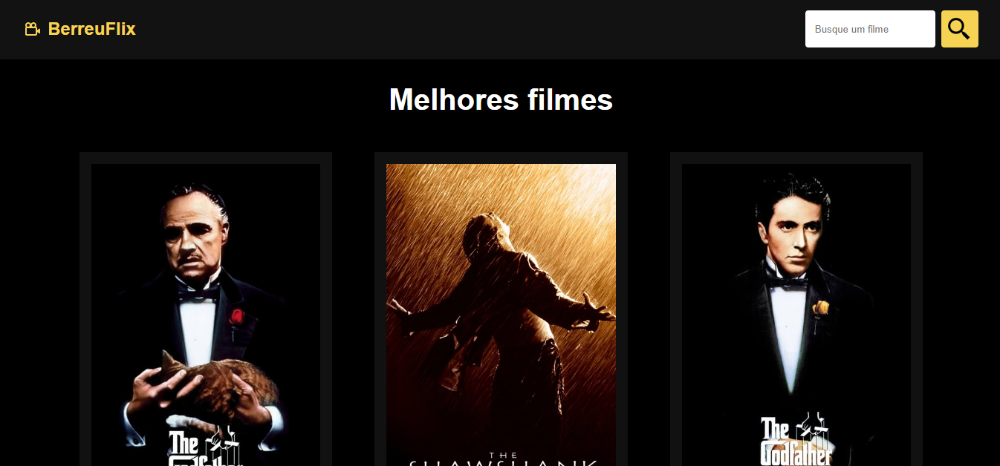

<h1 align="center">Welcome to BerreuFlix 👋</h1>

Projeto de filmes feito com o REACT.Js, consumindo a API de filmes do TMDB (The Movie Database)

##

Link de acesso => <a href="https://berreuflix.netlify.app/" target="_blank">https://berreuflix.netlify.app/</a>

 
  - React, React Hooks, React Router Dom, React Icons;
  - Consumo da TMDB API;
  - Projeto criado usando o VITE;
  - Funcionalidade de pesquisa;
  - Fetch API.

